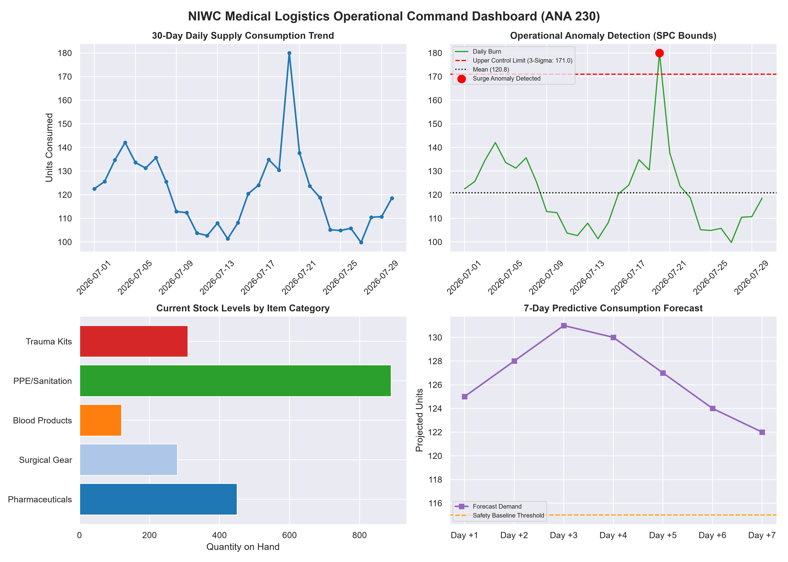

# Military Medical Logistics Framework

A starting point for modeling, acquiring, and cleaning logistics data that supports military medical operations.

## Repository layout

- `docs/` - architecture and design notes
- `schema/` - SQL definitions for the logistics data model
- `scripts/` - data acquisition, cleaning, analysis, and visualization utilities
- `notebooks/` - exploratory analysis notebooks

## Getting started

1. Review `docs/architecture_notes.txt`.
2. Apply `schema/01_create_logistics_tables.sql` to a MySQL database.
3. Acquire a CSV with `python scripts/data_acquisition.py https://example.invalid/logistics.csv` and clean it with `python scripts/clean_data.py --input data/raw/logistics.csv --output data/processed/logistics_clean.csv`.

The acquisition and cleaning scripts use the Python standard library. The statistical module requires the packages listed in `requirements.txt`.

## Applied Statistical Analysis (MTH 330)

The dedicated `scripts/statistical_analysis.py` module demonstrates applied quantitative analysis for medical supply logistics:

- **Hypothesis Testing:** One-sample t-testing evaluates daily medical supply burn rates against operational baseline targets at $\alpha = 0.05$.
- **Statistical Process Control (SPC):** 3-sigma upper and lower control limits detect supply surges and other anomalies.
- **Time-Series Forecasting:** Holt-Winters exponential smoothing projects seven-day future supply requirements.

Install the analysis dependencies and run the demonstration with:

```powershell
pip install -r requirements.txt
python scripts/statistical_analysis.py --mth330
streamlit run scripts/visualization_dashboard.py
```

The dashboard sidebar can also generate the ANA 230 executive command graphic with four panels: 30-day consumption, SPC anomaly bounds, category stock levels, and a seven-day demand projection. The PNG is saved to `docs/command_dashboard_sample.png`.

## Executive Command Dashboard (ANA 230)

The framework includes an automated visual telemetry engine in `scripts/visualization_dashboard.py`. It translates operational statistical anomalies, medical-category stock distribution, and seven-day predictive demand into an executive command dashboard.


